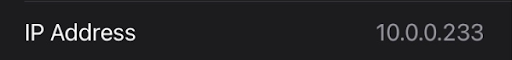
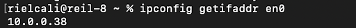
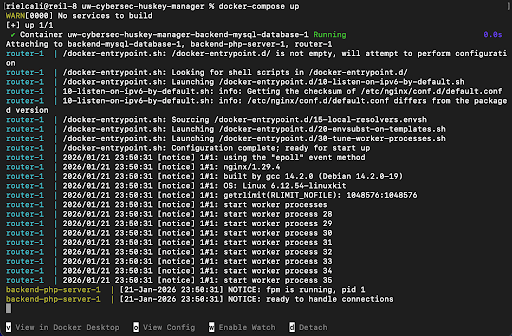
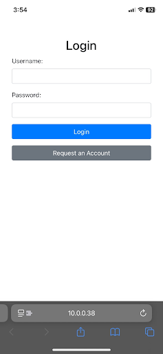
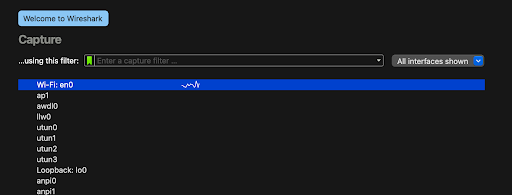
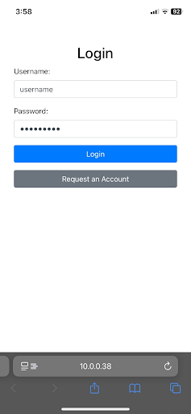
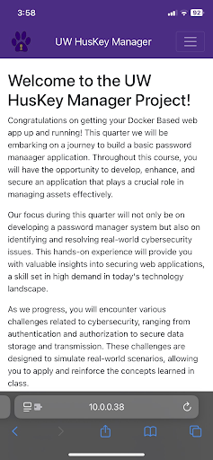
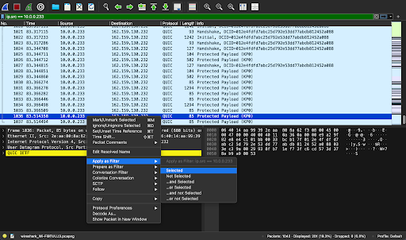
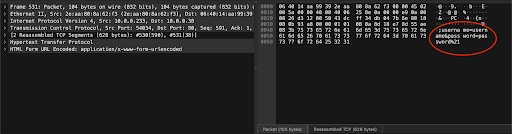

# Man in the Middle Attack
**Riel Calilung | January 1 2026**

## Introduction and Materials
To see and learn how vulnerabilities in networks can be exploited, I’ll be performing a Man in the Middle
attack using my iPhone and Macbook along with a web application, ARP spoofing tool, and Wireshark, a
network traffic analysis tool. With this setup, I’ll be able to read the network traffic coming from my
iPhone due to its connection to the web application being unencrypted as the connection occurs over
port 80.

## Steps to Reproduce
1. Obtain the iPhone’s IP address, which can be done by going to Settings, selecting Wi-Fi, pressing the blue “ⓘ” icon next to the Wi-Fi name you’re connected to, and scrolling down until you can see the address.

2. Obtain the Macbook’s IP address. Open a new terminal window and run the command, ipconfig getifaddr en0, which will return your Macbook’s IP address. Alternatively, you can follow the instructions from Step 1 and click the button labeled, “Details…”, instead of a blue “ⓘ” icon to find the IP address.

3. Run the web application on the Macbook. In my case, this is done by opening my terminal, moving to the appropriate directory, and running the command, docker-compose up.

4. Launch the ARP spoofing tool by running the command, sudo bettercap -eval "set arp.spoof.targets <victim IP>; arp.spoof on", and using the iPhone’s IP address.

5. On the iPhone, navigate to the web application. I did this by searching, http://[<computer IP address>]:80, on Safari and using my Macbook’s IP address.

6. Open the Wireshark app and select “Wi-Fi” as the filter.

7. Go back to the iPhone and sign into the web application.

8. Go back to Wireshark and pause the packet captures by clicking the red square on the top left side of the screen. Sort the packets by IP address by right-clicking any of the packet’s IP address and selecting “Apply as filter”. Then, on the green bar above the table, replace the IP address with the iPhone’s IP address.

9. Sort the packets by protocol by clicking the column on the top labeled, “Protocol”.

10. Look for the packets that are of protocol HTTP. Once you see them, find the packet that mentions, “POST”, and click it. This packet contains the information about the login credentials we used.

11. Upon clicking the packet, the login credentials can be seen in clear text.

## Analysis
1. Q: What is the specific asset you were able to obtain from your MITM?

    A: I was able to obtain the login credentials, the username and password.

2. Q: Which CIA Properties were violated in this attack and how were those properties violated?

    A: Confidentiality and availability were violated in this attack. The login credentials are something that only the user should know and have access to, however, as an attacker, I was able to see and know this information despite being unauthorized.

3. Q: Which specific values did you spoof?

    A: The attack used ARP spoofing which caused my computer’s MAC address to be incorrectly linked to an IP address from a legitimate source, such as a computer or server on a network. This allowed my computer to be seen as both the legitimate source from the victim’s perspective, and the recipient from the source or gateway’s perspective.

## Conclusion
In this lab, I can see how the creative and committed parts of the hacker mindset apply to this lab. As I carried out the steps for the attack, at some points, I wondered just who could come up with this sort of idea to intercept the connection between a recipient and gateway by posing as both. If I were the one planning the attack, I would’ve thought to impersonate the recipient. Not only was the logic behind the attack creative, but I imagine that it’d take a fair amount of commitment to pull it off, especially if the attacker created their own software for catching packets and for the ARP spoofing tool. Coming from a computer science background, I can only imagine how much understanding of system processes it’d take to write software used for this attack. Having a better understanding of MITM attacks, I can protect myself from them by avoiding websites that aren’t secure and by being wary of Wi-Fi networks that are unsecure as anyone can freely join them and perform MITM attacks. The biggest lesson I learned in this lab is to not only be committed but to not be afraid to think outside the box and see things from a different angle. This can be applied to all sorts of contexts as being open minded and creative can allow you to be flexible and find solutions in places others wouldn’t have.