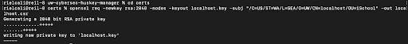
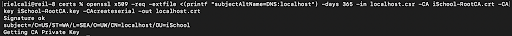
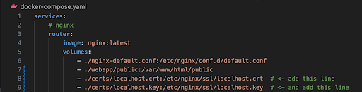
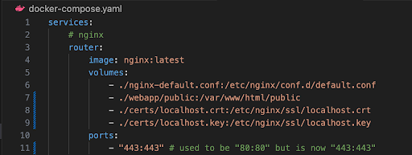
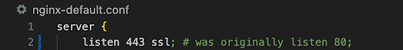
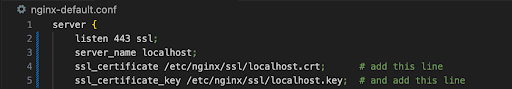
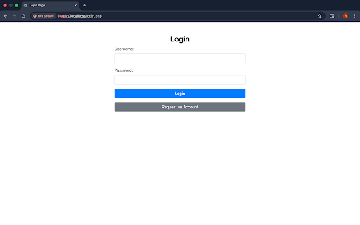
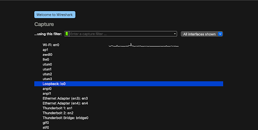
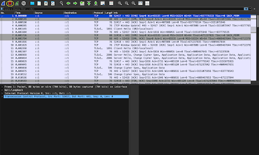
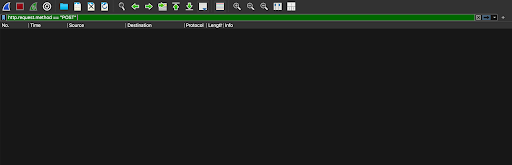

# Applying Cryptography
**Riel Calilung | January 26, 2026**

## Introduction and Materials
In the previous lab, I performed a Man-in-the-Middle attack on my web application and was able to obtain my own login credentials out of it, showing how unsafe my web application is. To fix this, I’ll reconfigure the application so that connections to it are encrypted. I’ll then reattempt the MITM attack on the application to verify its security. For this lab, I’ll be using just my Macbook to secure and attack the application.

## Steps to Reproduce
1. Install OpenSSL. Since I’m using MacOS I didn’t need to install it, however, depending on the OS that you are using, you may need to manually install OpenSSL.

2. Generate the certificate signing request (CSR). Open the terminal and navigate to the certs folder inside the project directory. Then, enter the command: **openssl req -newkey rsa:2048 -nodes -keyout localhost.key -subj "/C=US/ST=WA/L=SEA/O=UW/CN=localhost/OU=iSchool" -out localhost.csr**

3. Next, enter the command: **openssl x509 -req -extfile <(printf "subjectAltName=DNS:localhost") -days 365 -in localhost.csr -CA iSchool-RootCA.crt -CAkey iSchool-RootCA.key -CAcreateserial -out localhost.crt**. This will get us our signed certificate.

4. Open the project folder in a code-editor, such as VSCode. Find the file, **docker-compose.yaml**, and find the lines under services > router > volumes. Add the following lines:
    - ./certs/localhost.crt:/etc/nginx/ssl/localhost.crt
    - ./certs/localhost.key:/etc/nginx/ssl/localhost.key

5. In the same file, under services > routers > ports, change the port number 80:80 to 443:443.

6. Open the file, **nginx-default.conf**, and replace line 2 to be: **listen 443 ssl;**

7. In the same file, after line 3, the line containing the server name, add the following lines:
    - ssl_certificate /etc/nginx/ssl/localhost.crt;
    - ssl_certificate_key /etc/nginx/ssl/localhost.key;

8. Save the changes made to both files and run the web application by searching up, https://localhost:443.

9. Now that the web application is configured to use encryption, we can attempt a MITM attack to try to obtain our login credentials. Open WireShark and choose to capture from “Loopback:Io0”.

10. Sign into the web application, then return to Wireshark and stop the packet capture by clicking the red square on the top left.

11. Notice that unlike the previous lab, none of the packets mention “POST” in the INFO tab, which was how we found the packet with the login credentials. This shows that our web application is encrypted and no longer unsecure.

## Analysis
1. Q: What layers of the OSI model remain in clear text following our encryption implementation?

    A: The Physical, Data Link, Network, and Transport layers remain in clear text because TCP headers, IP addresses, and MAC addresses need to be visible for basic network operation. The Session, Presentation, and Application layers get encryption in our implementation.

2. Q: Which CIA Properties are protected that were previously violated during the MITM attack?

    A: Before, confidentiality and availability were violated in the MITM attack, but now that the web application is encrypted, both of these properties are protected.

3. Q: Why is encryption alone insufficient for establishing a fully trusted connection?

    A: To have a fully trusted connection both encryption and a valid certificate are needed. While encryption does protect the connection from any attackers, a valid certificate that is signed through a trusted Certificate Authority chain verifies the connection’s identity.

## Conclusion
As I worked through this lab, I thought about how much commitment and creativity it took to come up with and develop the encryption implementation and then apply that to networks and the internet as a whole. Despite only seeing cryptography work in a small scale setting, I could see how it applies to day to day life when there’s people all over the world whose computer connections need to be encrypted. For me, staying committed helped me through the lab as most of this consisted of reconfiguring my web application to be secure and then performing a MITM attack on it afterwards. In other contexts, having and keeping a committed mindset is essential for getting any task regardless of how big or small it is.