# Logging
**Riel Calilung | February 4, 2026**

## Introduction and Materials
In addition to making our web application secured through encryption, we can layer its defense by adding a logging service to our application. Through Loggly, a third-party logging service, we’ll be able to monitor the activity that goes on in our application and have a record of logs to look back at in the case of suspicious activity. To connect the web app to Loggly, I’ll be using my Macbook.

## Steps to Reproduce
1. Sign up for a [Loggly](https://www.loggly.com/) account.

2. From the Loggly homepage, on the left side bar, find the “Logs” option, hover over it and click “Source Setup”.

3. In the menu bar on top, click “Customer Tokens”. Take note of your customer token as it’ll be needed to tell our web application which Loggly account to send the log data to.

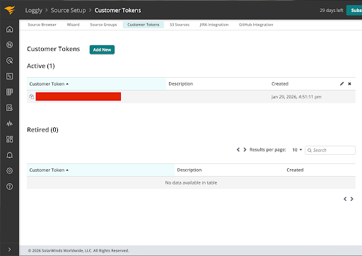

4. In a text editor or IDE, open the web application project file, uw-cybersec-huskey-manager. Open the folders, webapp > public > components. Inside the components folder, create the file, **loggly-logger.php**, like so

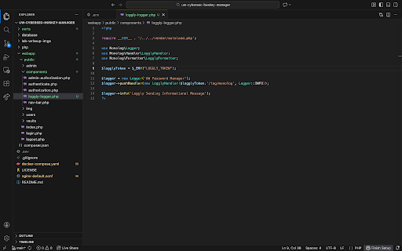

5. Within the web app project folder, open the **.env** file, and at the bottom add the line, “LOGGLY_TOKEN:”, with the value being your customer token from the Loggly website.

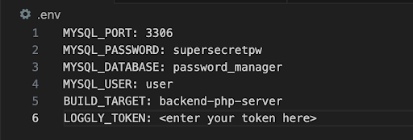

6. Open the file, **docker-compose.yaml**. Under “services”, find the section with comment, # php. Below build, add the tag “environment” like so and add the variable “LOGGLY_TOKEN” with its value set to what is saved in the .env file.

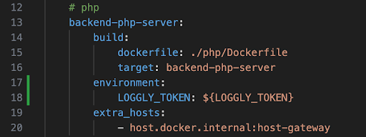

7. Navigate to webapp > public > **login.php**, and below the line, session_start(), add `include './components/loggly-logger.php';`

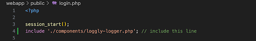

8. In the same file, in the if-else branch shown below, add the following line in the else case: `$logger->warning("Login failed for username: $username");`

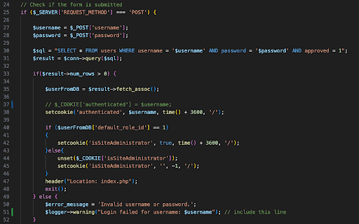

9. Save all the changes made to the project folder and then launch the web application. Certain activities, such as login attempts, are logged and we can access them on the Loggly website. As an example, let’s see what gets logged in the event of a failed login.

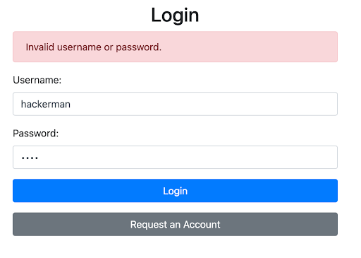

10. To access our logs, go to the Loggly website, hover over the “Logs” option on the left-side bar and click “Log Explorer”. From here, change the time frame accordingly so that we can find any logs about our failed login attempt.

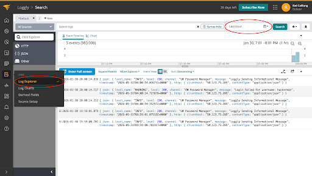

11. Notice that there’s a log with information about a failed login. By clicking on it we can see additional details about the log. Notice that the log’s message is about a failed login attempt.

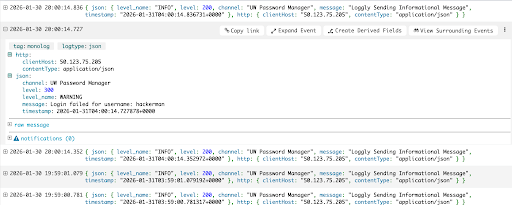

12. Now that Loggly works with our application, we can add more events to be logged. Since we added a log for failed logins, let’s add another for successful logins. In the **login.php** file, find the if-else branch that checks for logins. Inside the if-branch, add the following line:

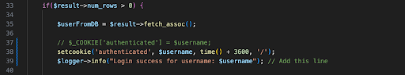

13. Next we’ll log when the user logs out of the application. Navigate to webapp > public > **logout.php** and then the following lines:

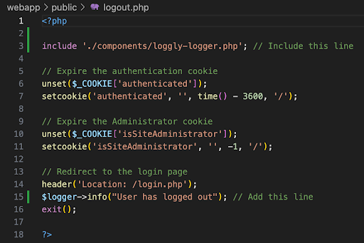

14. We’ll also log when the user adds or deletes a password from a vault. Navigate to webapp > public > vaults > vault_details.php and add the following lines:

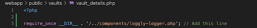
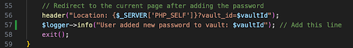
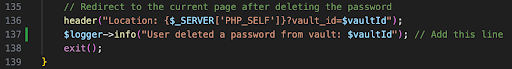

15. After making the changes, save the files, and relaunch the application using, “docker compose up –build”. When we log into our browser, we’ll see that we get logs for:
    - Logging into our account

    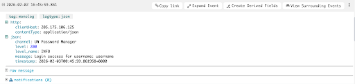

    - Adding a new password to our vault

    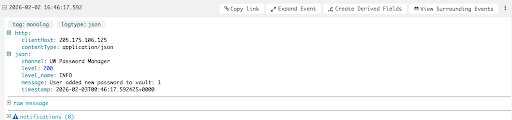

    - Deleting a password from out vault

    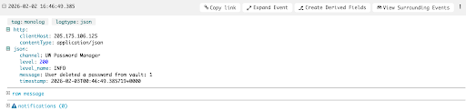

    - Signing out of our account

    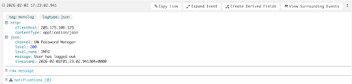

## Extra (Logging an Attack)
Another event we’re able to log is an attack. In this case, we’ll set up logging for a brute force attack- a basic attack that works by trying out multiple password credentials. To set this up, we’ll make the following changes to our **login.php** file with some help from ChatGPT:

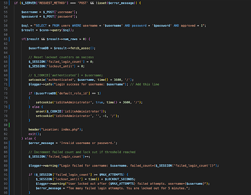

This portion of the code sets up the login page so that it keeps track of the number of failed attempts the user has made to log into the app- where a failed attempt is when either the provided username or password is incorrect. For every failed attempt, an internal counter is incremented by 1, and a log detailing the attempt is saved. After 10 failed attempts, the user is considered “locked out” and a message is displayed telling the user that they can try to log in after 5 minutes. In the case that the user was able to sign in successfully, the counter is reset back to 0 and they are logged into their account.

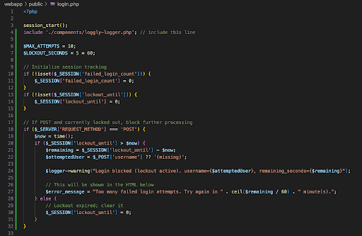

This portion of the code checks to see if the user is “locked out”. If the user isn’t locked out, they are allowed to make sign in attempts until they successfully log in or get locked out. In the case the user is locked out, they are unable to make sign attempts for 5 minutes and a log is saved. Once the lockout time is over, the user is no longer locked out and the counter for the number of failed attempts is reset.

In this screenshot, we can see our logs tracking the number of failed attempts up until the user makes their 10th failed attempt, where they are then locked out as well as what the login page looks like when that happens:

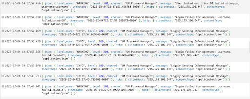

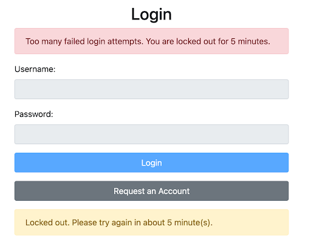

## Analysis
1. Q: The goal of cybersecurity is to protect assets. There are three ways we have discussed protecting assets. In terms of the methods we have discussed, how does logging help protect assets?

    A: Logging helps to protect assets because it creates a record of activities surrounding an asset. This is especially important for activities such as threat detection and incident response, digital forensics, and creating preventative measures as they rely on the evidence provided by logging.

2. Q: Where did you add logging? Why did you choose that location to add logging?

    A: I added logging when the user successfully signed in, when the user added or deleted a password from one of their vaults, and when the user logged out of the application. I chose these spots because they could be used as signs to determine if malicious activity happened on their account.

3. Q: As we continue to enhance and secure the UW Password Manager application, what other user actions do you believe should be logged?

    A: Other actions that should be logged include deleting password vaults, editing passwords, showing passwords, and downloading files corresponding to a password. These actions should be logged as they also can offer more insight as to whether or not malicious activity occurred.

## Conclusion
As simple as this lab was compared to the ones before it, adding logs provided our web application with another layer of security. While it doesn’t actively prevent attacks from happening, the information it provides is valuable for defensive practices such as threat detection and digital forensics, as well even for non-technical practices such as auditing. For this lab, I had to be a little creative with the events that I wanted to have logged. In particular I thought about events that could be considered suspicious or be used when analyzing an attack. Overall, this lab taught me that information, no matter the context, is always important. Again, logs themselves don’t stop attacks from happening, but the information you get from them influences the actions you take afterwards- the same can be said in situations outside of this class.