# Authentication and Authorization
**Riel Calilung | February 11, 2026**

## Introduction and Materials
Our application consists of web sessions where the user makes HTTPS requests and responses. For security reasons, it's important that these sessions are kept secure and managed properly. Through this lab, I’ll implement secure session management to the web application, and in the process, also see what insecure session management looks like through performing a session hijacking attack. To do this, I’ll be using VSCode, Docker, and the Developer Tools that are built into Google Chrome.

## Steps to Reproduce
For context, the password manager app has a “Global Admin” account that has full privileges on all the vaults and can manage all the accounts on the app.

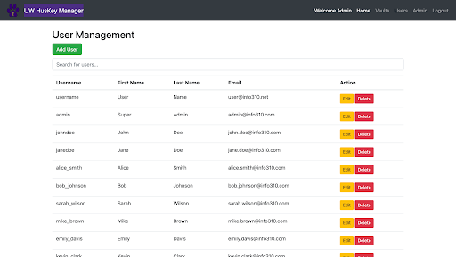

1. For lab setup, we’ll create our own account on the application. We’ll do this by clicking on the green “Add User” button towards the top left and provide the following details.

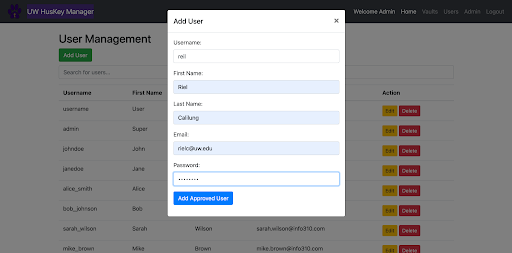

2. Next, we’ll log into our account, create a vault, and save three passwords saved on it.

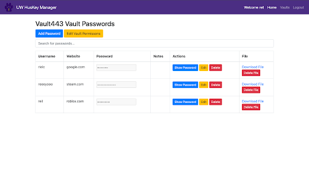

3. After setting up our account, we’ll log back into the Global Admin account and then open the developer tools in our web browser. From there, we’ll navigate to the “Application” tab, click the dropdown menu titled “Cookies”, and then choose the only option that it shows. Taking a look at the cookies, we can see that the username, Admin, is saved under **authenticated** and the value, 1, is the saved under **isSiteAdministrator** to signal to the website that the user is an admin. Knowing this, we can perform a session hijacking attack. In this case, we’ll sign into Jane Doe’s account without knowing her password.

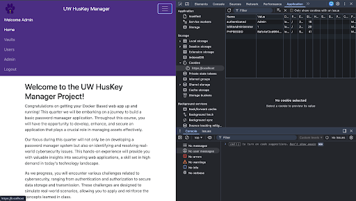

4. Return to the login page and open developer tools. Navigate to Application > Storage > Cookies, and then, create a cookie named “authenticated” and set its value to “janedoe”, which is Jane Doe’s username.

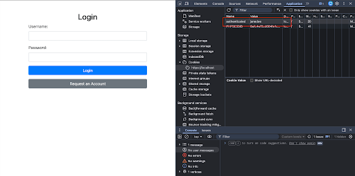

5. Next, change the URL at the top from, `https://localhost/login.php`, to `https://localhost`.

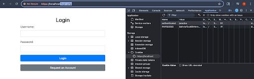
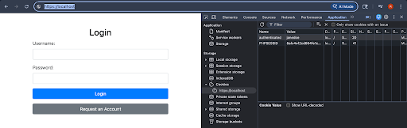

6. Then, press enter and you should now be logged into Jane Doe’s account.

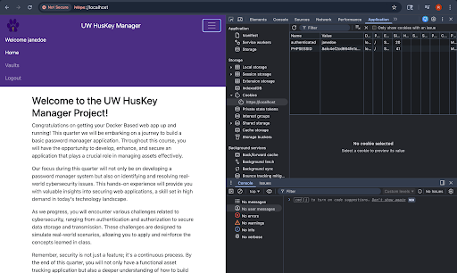

7. We’ll remedy our weak authentication mechanism by first making the following change to our **login.php** file:

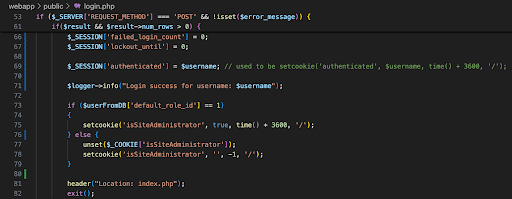

8. Next, we’ll update our **authenticate.php** file like so:

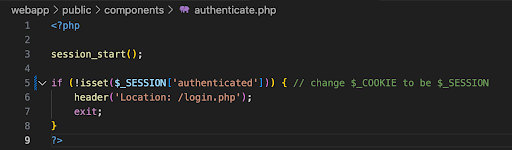

9. Then, we’ll update **logout.php** like so:

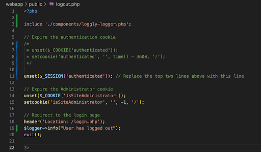

10. Lastly, we’ll make the following changes to **nav-bar.php**:

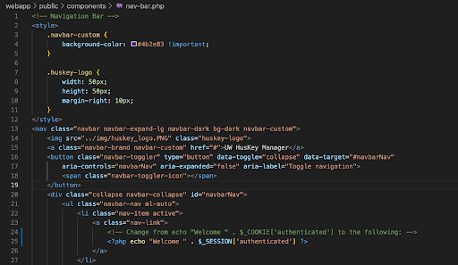

11. While these changes fixed the authentication vulnerability, users still have access to resources that they are unauthorized to use. To demonstrate this, I’ve logged into my personal account on the password manager and created the following cookie so that the website thinks that I’m an administrator.

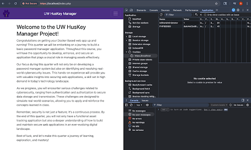

12. Next, I’ll change the URL from `https://localhost/index.php` to `https://localhost/index.php/admin/index/php`. After entering the URL, we can see that I’ve accessed the Admin panel without my account having the right permissions to do so.

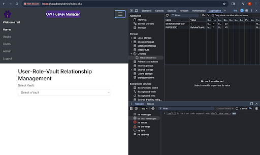

13. To prove that my account has gained access privileges it shouldn’t have, I’ve added myself as the owner of the Developer and Executive vaults.

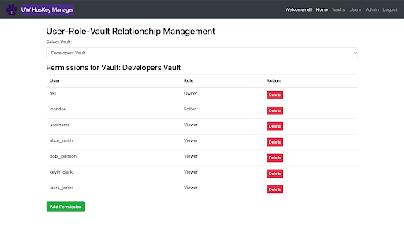
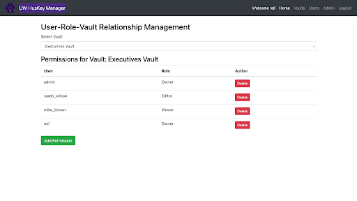

14. To secure authorization, we’ll start by updating **login.php** like so:

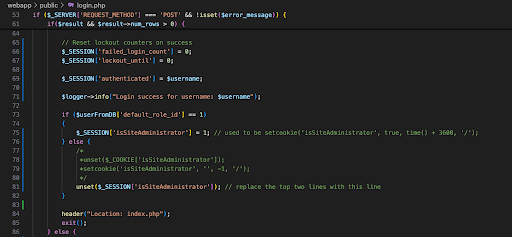

15. Next, update the **admin-authorization.php** file like so:

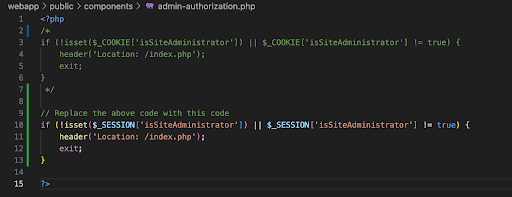

16. Update **logout.php** like so:

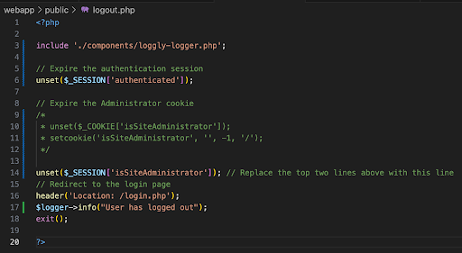

17. Update **vault-details.php** like so:

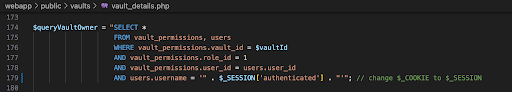

18. Update **nav-bar.php** like so:

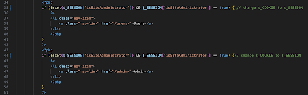

19. With these changes, we’ve fixed the authorization vulnerability our application had. To further secure our app, we can replace all instances of “_COOKIE” with “_SESSION”. To this on Mac, hover towards the top of the screen and click “Edit” > “Find in Files”.

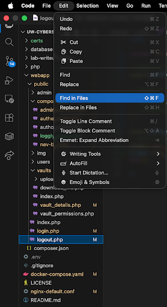

20. A search menu will appear where you can enter “_COOKIE” to find all of its instances.

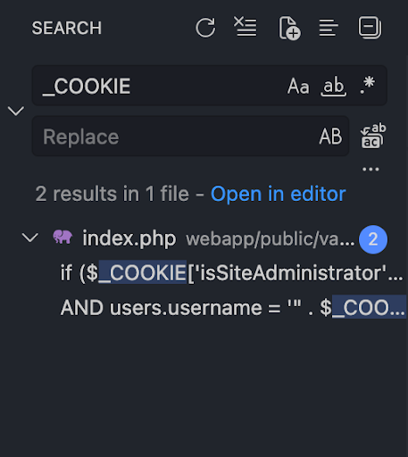

21. We’ll replace the remaining instances of ‘_COOKIE’ with ‘_SESSION’ to keep the app’s functionality consistent and reduce the attack space for any potential threats.

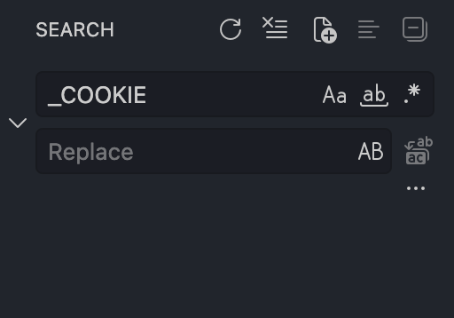

## Analysis
1. Q: The goal of cybersecurity is to protect assets. In terms of the three tier architecture how did changing from _COOKIE to _SESSION alter the authentication process?

    A: The authentication process changed from being handled on the client tier to the middle/logic tier. So instead of authentication occurring on the user’s web browser, it happens on the server hosting the web application.

2. Q: Why is using our session ID more secure than using the 'authenticated' and 'isSiteAdministrator' cookie?

    A: Using our session ID is more secure because it is managed by the server meaning that we, the client, do not have control over it like we did with “authenticated” and “isSiteAdministrator”. Thus, we can’t exploit it to log into other user’s accounts or gain access to resources that we aren’t authorized to. Additionally, session IDs can expire over a given amount of time, are unique per user, and have other properties built into them to make them secure and harder for an attacker to access.

3. Q: In what way can we further secure authentication for our password manager? What concepts or mechanisms that we discussed in lecture allow us to further secure our password manager?

    A: To further secure authentication, we could implement 2-Factor authentication so that the user is required to show authentication through another device. Implementing biometrics would be another strong way to secure the password manager.

## Conclusion
My biggest takeaway from this lab is how session hijacking works and the importance of keeping security aspects implemented in the middle/logic tier. I’ve always seen and known that cookies were a big part of website functionality, but this is the first time that I’ve seen them actually be “important” and I never knew they could be used in attacks. Authentication and authorizations works against the hacker mindset because it forces them to think of ways to bypass the added layer of security, and even if a hacker were to get past the authentication layer, the authorization part prevents them from gaining full access to unauthorized resources. Ways that a hacker can bypass the authentication and authorization mechanisms we have in place can be through attacks such as session fixation or XSS-based session hijacking that focus on exploiting the victim’s session ID to gain access into the application.