# Bug Bounty and Hardening Lab
**Riel Calilung | March 6, 2026**

## Introduction and Materials
Similar to the last lab, this lab aims to strengthen the security of our password manager application through performing a bug bounty on our application to search for any security vulnerabilities so that we can remediate them. For this lab, I’ll be using just my laptop and VSCode.

## Steps to Reproduce
**Vulnerability 1: SQL Injection (Login Page)**
One vulnerability that our app has is an SQL injection at the login page. By entering, ' OR 1=1 -- , as either the username and the password to anything we want, it’s possible to login into the app without using a valid account.

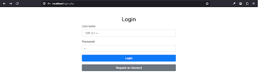
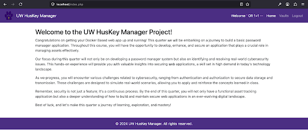

Alternatively, by setting the password to, ' OR 1=1 -- , and setting the username to a valid username, such as janedoe, it’s possible to login into their account without knowing their password.

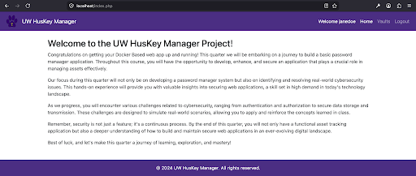

1. To start fixing this, we can start by navigating to our project files and going to webapp > public > `login.php`

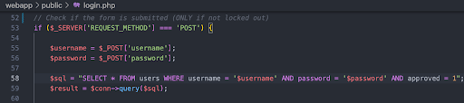

2. In the portion of login.php shown above, change lines 58-59 to be the following:

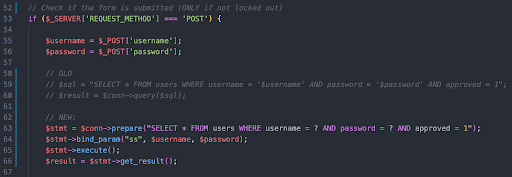

3. This fixes the SQL vulnerability in our app’s login page. Now, using, ‘ OR 1=1 -- , as a username or password no longer allows for potential attackers to log without an account or into other user’s accounts.

**Vulnerability 2: Reflected XSS**
The input fields in the application’s “Request an Account” page are vulnerable to XSS attacks, meaning that user supplied input can potentially be malicious JavaScript code. For instance, providing the input, ``, in the “First Name” field resulted in a popup appearing.

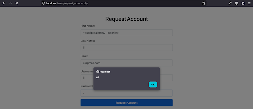

Notice that inside the red error message box, the exploit string we entered doesn’t appear. This shows that the application isn’t sanitizing user input.

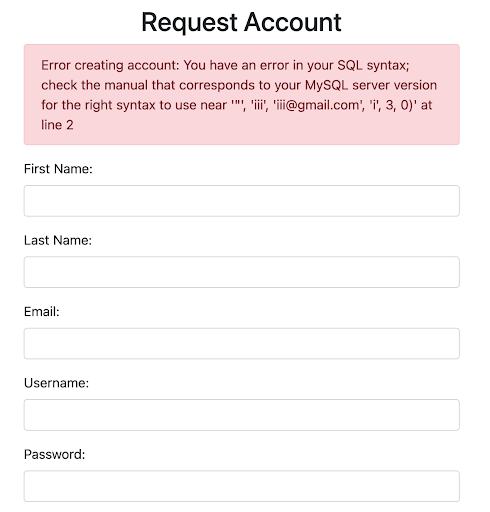

1. To fix this, navigate to application files and go to webapp > public > users > `request_account.php`

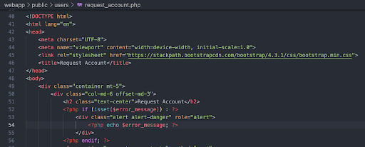

2. Replace line 54 with the following:

3. Now, if we try to repeat the same attack again, we can see that the exploit string we entered in the “First Name” field is visible, meaning that it no longer gets interpreted as JavaScript code but instead as a literal string. And so, we’ve patched the vulnerability on this page.

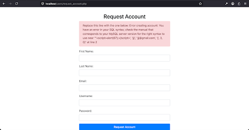

**Vulnerability 3: Lack of account timeouts**
While not exactly a bug, our app has a vulnerability related to insecure session management where users aren’t automatically logged out by the app if they’ve been idling for too long. By implementing a patch for this, we add another layer of security that reduces the surface area for attackers to work with and minimizes the chances of human error in being a factor in potential attacks.

1. Open the project files and navigate to webapp > public > `login.php`, and add the following line:

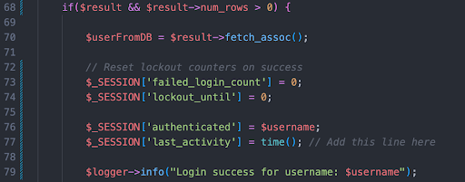

2. Navigate to webapp > public > components > `authenticate.php`, and add the following lines:

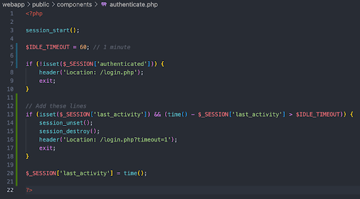

With this patch implemented and after rebuilding and relaunching the app, if there is no user activity within a 60 second time-span, the user will be logged out.

## Analysis
1. Q: For each of your remediations, name which of the three pillars of the CIA triad your remediations protected.

    - **SQL Injection Patch**: Protects confidentiality by requiring the user’s password rather than using malicious SQL code, and protects integrity because accounts can no longer be easily accessed and have the information saved on them be tampered with.
    - **Reflected XSS Patch**: Protects confidentiality and integrity. Confidentiality is protected because user data, such as browser/session cookies, can’t be stolen because user supplied input is sanitized and is treated as literal strings rather than JavaScript code. Integrity is protected in how attackers are no longer able to modify page content or inject HTML/JS elements.
    - **User Timeouts Implementation**: Protects confidentiality and integrity by preventing unauthorized use of the user’s accounts. For instance, if the user were to leave their computer unattended while still logged into the page, a malicious individual could simply go up to their computer and steal/manipulate any information on the user’s account.

2. Q: Which of the cybersecurity principles discussed in class were enacted by your remediation efforts?

    A: My remediation efforts enacted defense in depth through including safe guards against SQL injections by utilizing parameterized queries rather than allowing user input to affect logic, and by sanitizing user input in XSS attacks. In addition to these, I implemented a feature to log the user out if they idle for 60 seconds, which can prevent any unseen attacks. The feature is also a form of the secure by default principle as it causes the app to change to a safer state rather than having its session open indefinitely.

## Conclusion
Even with the patches, there are still ways for hackers to compromise the confidentiality, integrity, and availability of our password manager app. For example, an attacker could utilize a DDoS attack to prevent the app from functioning for other users, compromising availability. Before my remediation efforts, there was actually a good amount of risk involved with using the app. Aside from the already vulnerable login page, it lacked any other security implementation. After my remediation efforts, I’d consider the risk to be considerably lower than it was before, especially now that the app isn’t vulnerable to SQL injection or XSS attacks, however, it’s worth noting that any input fields past login may still be vulnerable. This means that the attacker would need to have an account before attempting to attack the application, which could work as a deterrent.