# Remediation and Testing
**Riel Calilung | March 11, 2026**

## Introduction and Materials
To ensure our app’s consistent functionality, we can implement tests that check to see if our app is working properly. This is especially important if new features are being implemented or if there are bugs/vulnerabilities with the app. In this lab, I’ll be using Selenium (through the Firefox browser since Google doesn’t support it) and Pytest to create test cases that double check the password manager’s functionality.

## Steps to Reproduce
1. First, launch/install Firefox browser, then click the puzzle piece icon towards the top right side

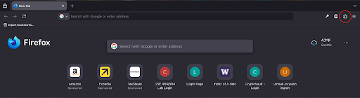

2. Then click “Discover extenstions”

3. In the search bar labeled “Find more add-ons”, enter “Selenium IDE” then click enter

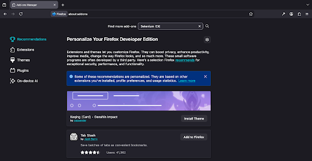

4. Choose the top most option, which should be named “Selenium IDE”, then click “Add to Firefox”

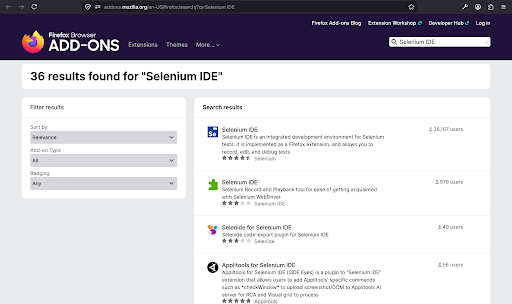
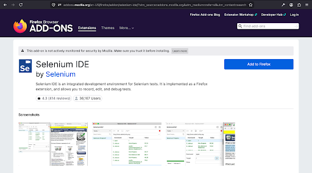

5. Now, we’re able to create test cases for our password manager. To start, click the Selenium extension icon towards the top right.

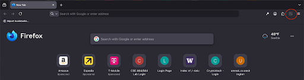

6. Once Selenium opens, select “Record test in a new project”.

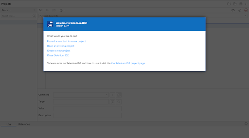

7. Give the project an appropriate name, then click “OK”.

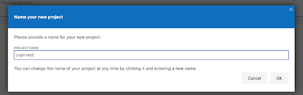

8. Provide the URL for our password manager app. Since this is running on our computer, enter, `https://localhost`. Then, click “Start Recording”. From here we can create our test cases.

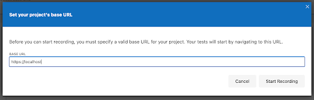

9. Once we have a test case that we’ve finished creating, for example, one that checks for valid login functionality, we can hover over our test and click the three dots next to the test name.

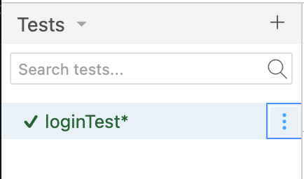

10. Choose “Export”

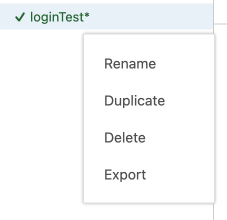

11. Select “Python Pytest” and then click “Export”.

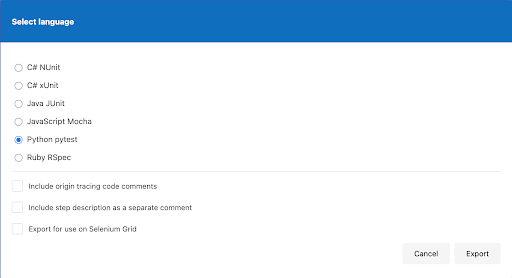

12. The Pytest file should then be saved in a folder in our project files called, `pytest`

13. Once all your tests are in the `pytest` file and are ready to be ran, using a terminal with the project files open, enter “pytest” to run all the tests.

Out of these tests, the autoLogoutTest and the sqlInjectionTest helped to reduce the most risk in the application.

### autoLogoutTest

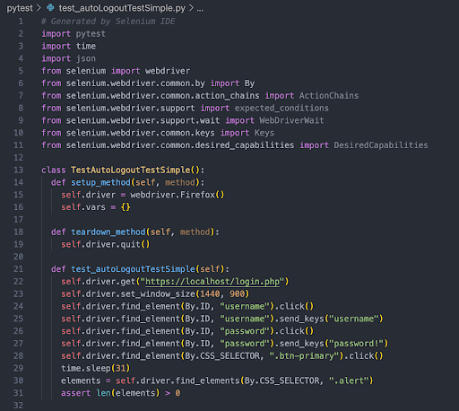

### sqlInjectionTest

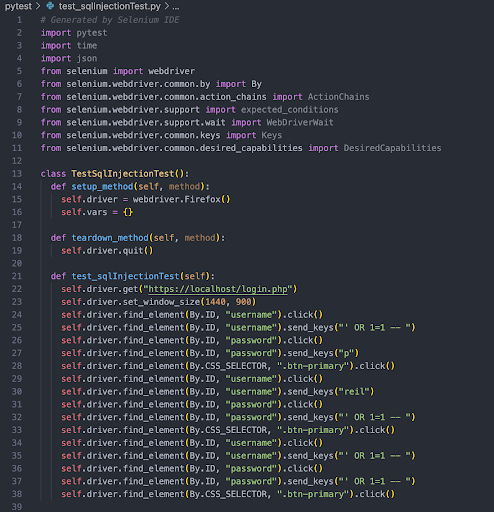

## Analysis
1. Q: How did you prioritize the selection of your test cases?

    A: I prioritized the selection of my test cases based on which ones have the highest risk associated with them as well as having the most functionality associated with them. I included login and logging out tests because, while they are simple, it’s important that the user is able to login into the app in the first place- same goes for logging out. Additionally, these tests can be used as regression tests to ensure core functionality. I included tests for XSS attacks, SQL injections, and for automatic logging out as these tests ensure that the password manager has security against these types of attacks and maintains strict session management.

2. Q: For two of your tests answer the following: Which of the cybersecurity triad properties does your test ensure is now protected?

    **Automatic Logout Test**
        - Ensures confidentiality and integrity through preventing other unauthorized users from accessing and potentially tampering with a user’s account.

    **SQL Injection Test**
        - Ensures confidentiality and integrity. Preventing manipulation of SQL logic makes it so that attackers cannot sign in without having credentials, they can’t sign into an admin account without knowing that account’s credentials, and they can’t tamper with any data on the server side and other user’s accounts.

## Conclusion
Some issues that might be unaddressed by my peers’ password manager include vulnerabilities to files that an attacker could input once they’re already signed into the app and the inclusion of an automatic logout feature. While it’s known that an attacker could provide a malicious file into the app, thoroughly checking that the file provided isn’t malicious isn’t an easy task, even if mechanisms such as filtering types are implemented as there’s, generally, a good amount of attack surface that can be taken advantage of. Not forcing the user to logoff after idling for too long is already a security weakness, but it can also affect operational costs. Additionally, I don’t think that there are defenses against more advanced forms of XSS attacks and SQL injection. That being said, I think the most effective way to break into a peers’ password manager is through advanced attack techniques or through finding a vulnerability in the manager’s feature of accepting a file. To detect if another peer tried to exploit my password manager, I’d first look at the logs I have in place to see what actions took place so I can try to understand their attack. From there, I’d try to identify what vulnerability they exploited and create a fix for it. Before releasing the fix, I’d also make sure to run it against some test cases made for it and some regression tests to ensure that it didn’t affect anything that it shouldn’t have.